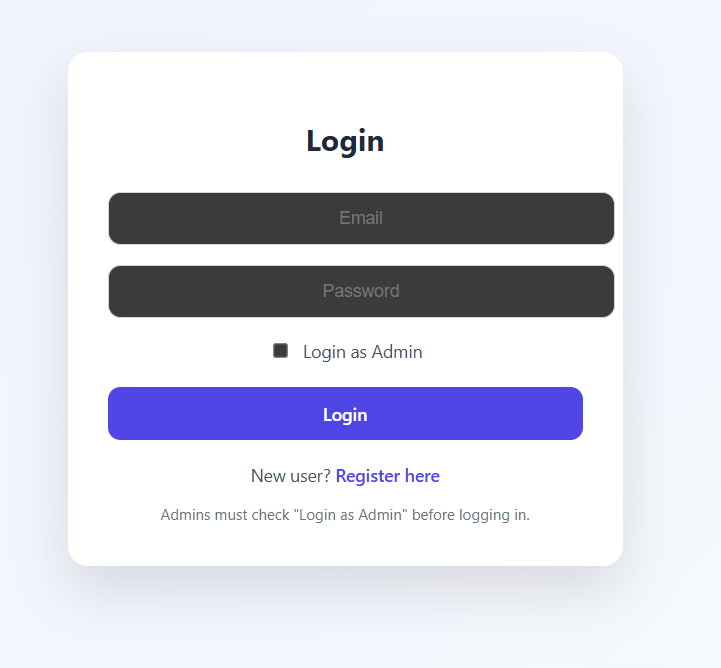

# 🍬 Sweet Shop Management System

A full-stack Sweet Shop Management System built using **React**, **Node.js**, **Express**, **MongoDB**, and **JWT Authentication**.  
The system supports **User** and **Admin** roles with role-based access control.

---

## 🚀 Features

### 👤 Authentication
- User registration and login
- Admin login using role-based authentication
    admin email: ankit@test.com
    password: 123456
- Secure JWT-based authentication
- Logout functionality

### 🍭 Sweet Management
- View all available sweets
- Search sweets by name or category
- Purchase sweets (quantity decreases automatically)
- Disable purchase when stock is zero

### 👑 Admin Features
- Add new sweets
- Restock existing sweets
- Delete sweets
- Real-time inventory updates

### 🎨 UI/UX
- Modern card-based dashboard
- Responsive design
- Professional color palette
- Clean and intuitive interface

---

## 🧑‍💻 Tech Stack

### Frontend
- React
- React Router
- Axios
- CSS (Custom Styling)

### Backend
- Node.js
- Express.js
- MongoDB
- Mongoose
- JWT (JSON Web Token)

---

## 🔐 User Roles

| Role  | Permissions |
|------|------------|
| USER | View sweets, search, purchase |
| ADMIN | Add, restock, delete sweets + all user permissions |

---

## 🛠️ Setup Instructions

### 1️⃣ Clone the Repository
```bash
git clone https://github.com/your-username/sweet-shop-management-system.git
cd sweet-shop-management-system


2️⃣ Backend Setup

cd backend
npm install

Create a .env file inside backend:

PORT=5000
MONGO_URI=your_mongodb_connection_string
JWT_SECRET=your_secret_key

Run backend:
npm run dev

3️⃣ Frontend Setup
cd frontend
npm install
npm run dev

Frontend will run on:
http://localhost:5173

Backend will run on:
http://localhost:5000

📸 Screenshots

### 🔑 Login Page


### 📝 Register Page


### 🍬 User Dashboard


### 👑 Admin Dashboard


### ➕ Add Sweet (Admin)


📚 Learning Outcomes

Full-stack application development

RESTful API design

JWT authentication & authorization

Role-based access control

MongoDB schema design

React state management

UI/UX best practices

👨‍💻 Author

Ankit Kumar
B.Tech (3rd Year)
Full Stack Developer

🏁 Conclusion

This project demonstrates a complete production-style full-stack application with secure authentication, role-based access control, and a modern responsive user interface.

⭐ Acknowledgements

This project was developed as part of a learning-based full-stack development exercise and follows industry-standard best practices.

✅ How to Use This File

Create a file named README.md in your project root

Paste everything above

Add a screenshots/ folder with images

Push to GitHub

git add README.md screenshots
git commit -m "Add final README and screenshots"
git push